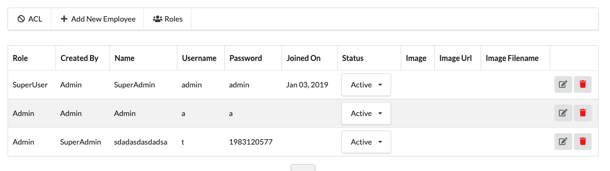
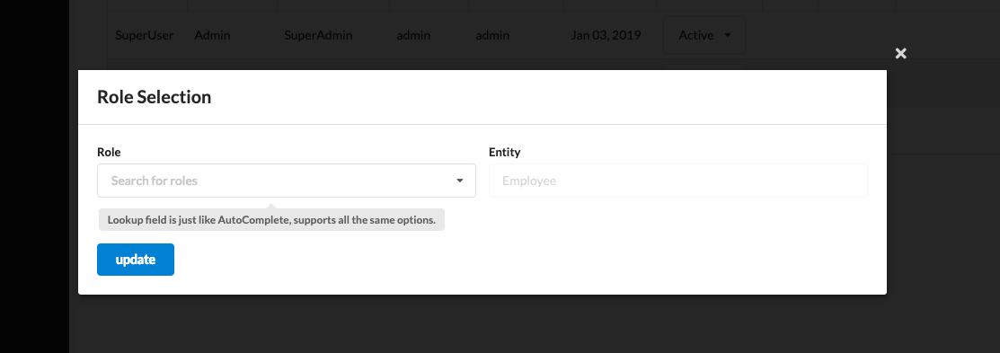
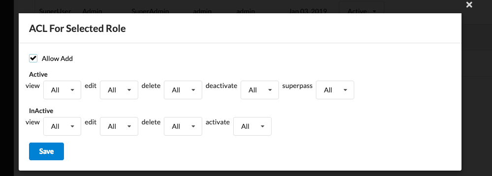
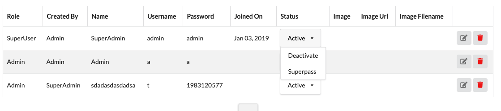

# Welcome to Atk4 Advanced ACL

We have been using this Acl in 4.3 from long and found it speeds up your development process a lot. This is a system that truly lets you focus on business logic. Here we are lauching it as atk4/ui add-on

# Basics

The base of this ACL System is simple. EveryEntity in any system has one or more status and on every status there are some doable actions. There are two things you want to conver in any Acl.

- Deside which status is visible to whome (user) for eaxmple.
	Lets assume you have Invoice Document and It has following actions on various status
	
   

  

       $actions = [
        		'Draft'=>['view','cancle','edit','delete','submit','other_info','manage_attachments','communication'],
        		'Submitted'=>['view','cancle','edit','delete','other_info','redesign','approve','manage_attachments','print_document','communication'],
        		'Redesign'=>['view','edit','delete','submit','other_info','cancle','manage_attachments','communication'],
        		'Approved'=>['view','edit','delete','redesign','paid','send','cancel','other_info','manage_attachments','print_document','communication'],
        		'Paid'=>['view','edit','delete','send','cancel','other_info','manage_attachments','print_document','communication'],
        		'Canceled'=>['view','edit','delete','paid','redraft','other_info','manage_attachments','communication']
        		];

Now you want to manage following Acls
- Draft user can see only what they created and they should be able to submit it
- Authority with Approval permission should see all submitted documents and able to approve Invoices.
- Person who created Draft should be able to see Approved status Invoice but he will not be able to perform any action on it.
- Approved Invoice should get send_via_email enabled and that too allowed to some Role only
- And Implementing this all sort of functionality should be easy and the system should help you implement same in very easy method.

Thats what Atk4Acl is.

 
## Install

Installation is as easy as
- **composer require gowrav-vishwakarma/atk4acl**
- Second step is to populate Sql file in **vendor/gowrav-vishwakarma/atk4acl/docs** folder
- Populate some configs defined in **vendor/gowrav-vishwakarma/atk4acl/src/config-example.php** in YOUR CONFIG files (not in this file)

## Setup Auth Model With Role

- So by now, you have one user Model that is working with **atk4\login** as **$app->auth->model**
- $your_model->hasOne('role_id',new \atk4\acl\Model\Role)->withTitle();
- that's it. BTW it is also customizable that you have Department->Post->Employee and want to use post_id in employee as Role by config.
        
## Into the Actions

Once you are done with setup. You can now start using it. There are two sort of things you should be looking at

- How to define Permissions
- How to write status/action relation and write code for actions

First thing you will do is to use \atk4\acl\CRUD like this

    $crud = $this->add('\atk4\acl\CRUD');
    $crud->setModel('\your\namespace\Model\Invoice');

Based on your defined Super Scope Roles in config 

    $config['acl']=[
		'AclModelClass'=>'\atk4\acl\Model\Acl',
		'UserModel' =>'\your\namespace\Model\Employee',
		'SuperUserRoles'=>['SuperUser'], ⇐ HERE
	];

you will automatically get ACL Button on top of CRUD and that will manage everything for you. But to make it run you need to define your status and actions in model first.

Defining actions on status is as easy as creating one **public $actions ** class variable in your models. like this
  

     $actions = [
        		'Active'=>['view','edit','delete','deactivate','superpass'],
        		'InActive'=>['view','edit','delete','activate'],
        		];

Out of these 'view', 'edit' and 'delete' are taken care automatically with options **SelfOnly** , **All**, **None**

SelfOnly means use will be only be able to do action (even view/edit/delete) That he himself has created (based on **created_by_id** field in Model) 

While All let user see all Entities **OF THAT STATUS**.

If your Model has Field **assigned_to_id**, you can Even manae Acl to perform actions on your assigned Entities only.

--- 

Here comes interesting part. 
How to code for those actions. For view, edit and delete you don't have to code anything. but for other actions you just create function in that Model with the name of that action like to code 'deactive' action just create function in yout model

    class Invoice extnds \atk4\data\Model {
		...
		public $actions =[
			'Active'=>['view','edit','delete','deactivate'],
			'InActive'=>['view','edit','delete','activate'],
		]
		...
		function deactivate(){
			$this['status']='InActive';
			$this->save();
		}
		function activate(){
			$this['status']='Active';
			$this->save();
		}
    }

And fun doesn't stops here, sometime you need some user input to perform some actions like creating a form and do somthing on its submit.
Well, just define one more action in any/all status and create function name with prefix **'page_'** ex.

    class Invoice extnds \atk4\data\Model {
    		...
    		public $actions =[
    			'Active'=>['view','edit','delete','deactivate','update_email'],
    			'InActive'=>['view','edit','delete','activate'],
    		]
    		...
    		function page_update_email($p){
	    		$form = $p->add('Form');
	    		$form->addField('email');
	    		$form->onSubmit(function($f){
		    		$this['email'] = $f->model['email'];
		    		$this->save();
		    		return "Updated"
	    		});
    		}
        }

Istn't it interesting. More we are working on next version to implement auto Dialog close and CRUD relaod while it is page_function.

For now, Its just initial commit and we will see more updated soon. 
